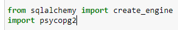
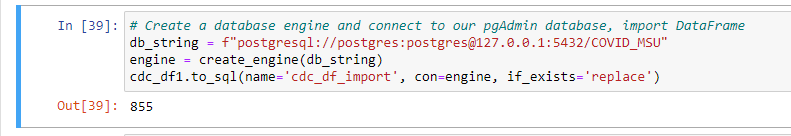
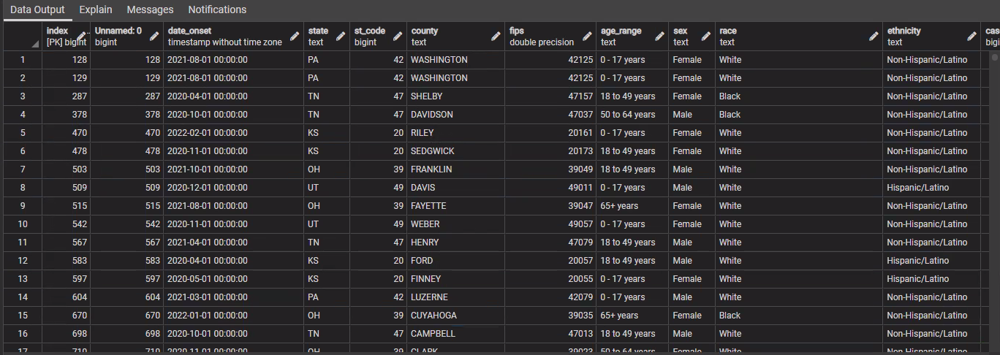
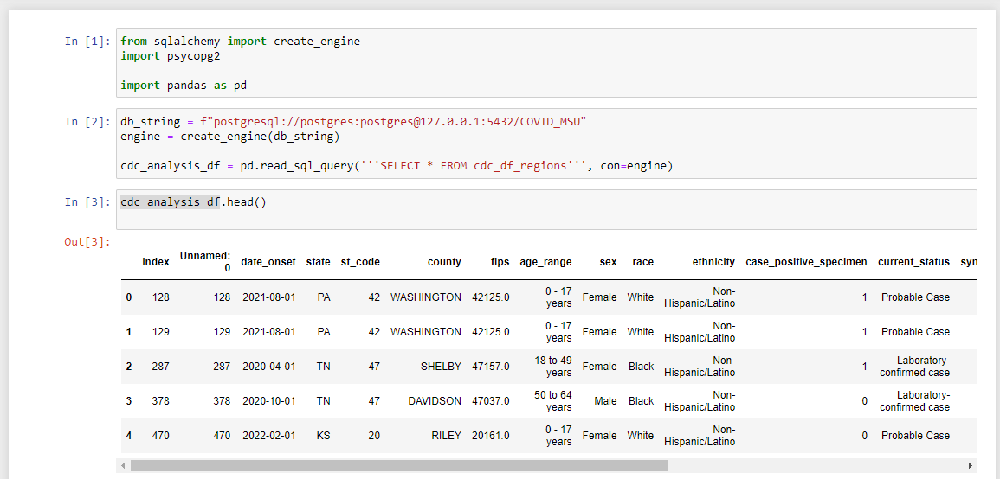

# COVID_Death_Analysis
An analysis of COVID-19 deaths and possible correlating factors

## Topic
Factors contributing to the death of COVID-19 patients 

## Topic Purpose
COVID-19 has affected nearly every person on this planet in at least one way since its outbreak in early 2020.  Many people have been impacted by the death of friends and/or family and are asking why this happened and if it could have been avoided. While those heavy questions may not be able to be answered fully by simple data analysis, we hope to generate conversation by using the COVID-19 Case Surveillance Public Use Data with Geography dataset to discover connections between certain demographic and geographic factors and death of COVID-19 patients.

## Technologies
### Tools
- Github
- pgAdmin
- Jupyter Notebook
- Tableau
### Languages
- Python
- postgreSQL
### Libraries
- Pandas
- Numpy
- Pathlib
- sklearn
- sqlalchemy
- psycopg2
### Algorithms
- Logistic Regression
- SMOTEENN

## PRESENTATION LINK
https://docs.google.com/presentation/d/1mb-FrvVJSPmFRAVFaV_9wm2A9y0N-OhCBasbagVjU_E/edit?usp=sharing

## Question to Answer 
- Can a machine learning model be used to help predict the likelihood of death from COVID 19 based on demographic and geographic factors?

## EXTRACT-TRANSFORM-LOAD

### Data Source -EXTRACT
https://data.cdc.gov/Case-Surveillance/COVID-19-Case-Surveillance-Public-Use-Data-with-Ge/n8mc-b4w4

This dataset is a deidentified patient-level record of reported COVID-19 cases from January 1, 2020 to present, updated once per month, with currently 90+ million rows and 19 columns.  It was selected because of its large record quantity, presumption of quality, and our belief that it should have good predictive qualities and plenty to explore. We liked this dataset in particular because it includes geographic data.  

An API call was placed to https://data.cdc.gov/resource/n8mc-b4w4.json to extract the data from the link above and exported to a csv file (cdc_api_df_all.csv). This code is found in the file named ETL_E_API_Export.ipynb.  

We chose to collect a large sample of records from the CDC and then drop any with NANs or values of "Unknown", "Missing", or "NA". Subsequent investigation with different samples of 1000 records showed anywhere from 1.5% - 3.3% of the records in a given dataset could remain post-cull. The code was adjusted to pull a total of 250,000 records from the API call as a precaution.

### Data Munging -TRANSFORM + Data Observations & Limitations

After initial exploration (found in ETL_T&L.ipynb) using .head(), .describe(), .value_counts(), and .dtypes, several other methods of data wrangling were used in preparation for data analysis: dropping a column/s, manipulating datetime into new columns, changing dtypes, and removing records based on a value.  Afterwards, looking at our record distribution, we saw that records of patients residing in Utah, Ohio, Pennsylvania, and Kansas comprised 71.55% of the cleaned dataset, compared with only 20.04% of the raw API-called data. Futhermore, our final set contains records of patients residing in 19 unique states or territories, while the raw set, 45. Given that during the API call, we were only able to obtain 250k records out of 87.3M, of which we only received 111,945 (a 0.13% sample of all of the data), which was then further reduced through the ETL process to 2,875 records (a 0.0033% sample of the original 90M+ record dataset) we grew concerned about the affect such a small sample could have on statistical importance. When we did finally figure out how to download the whole CDC dataset, we also found its records’ geographic distribution was uneven. We would have liked to work with the entire dataset, but unfortunately ran out of time. 

After creating our database in pgAdmin (named 'COVID_MSU'), I added our code in Jupyter Notebook to create the connection between it and our clean dataset and its new database home.
### Database -LOAD

This code takes our finished, cleaned dataset from our Jupyter Notebook file and pushes it inside the new, empty database in pgAdmin.  It does this by first importing dependencies that allow us to create the required database engines, connections, and adaptors. Next, we create "db_string", which with all of its database credentials, is rather like a key for the following ‘engine’ we create and then use as our connection inside the to_sql() method that imports our data from JN into pgAdmin.   

Very similar code is run to reverse this process to allow for an integration from pgAdmin *to* Jupyter Notebook for our logistic regression analysis. A mockup of the code that we’ll use in our machine learning model code is below. 

## Further Exploration and Beginning Analysis
From here, we created a series of tables in the database to both explore and help analyze trends in our data, the code for which can be found in ‘tables.sql’. These tables looked at cases by census regions, sex, specific age groups, case status, and by county-level. This exploration made it apparent that we lost much of the data that would have made the sample truly representative, as there were many fewer counties than the population represented.  We also realized we transformed each category from the main data table (like age_range, for example) into a series of tables aggregating unique category values (a table of records of 0-17 ages, one for 18-49 ages, etc.). In contrast, we only had a single table, 'region', where we instead took many state location values and categorized them into fewer. 

We then shifted our approach, added the 'region' table on to our original table, saved it as a new table by using conditionals to populate the US Census region for each case, and then used that data in Tableau to analyze our data.  This table is called cdc_df_regions.  

## Analysis Phase
Most of the analysis was conducted using Tableau, a visual analytics platform built to take in multiple data sets that allows for nearly code-free visualizations of that data.  Age Range, Hospitalization Status, ICU Admission Status, Race, US Census Region, Sex, and Symptom Status were taken into consideration and compared with the total death count to visualize any correlation.  We break down the make-up and features of these tables in the Dashboards section, but below are their observations.

### Observations
- Distribution of cases by region/year
    - We saw that the West coast contained the most deaths by year during our dataset (with the caveat that our current geographical data isn't representative of the US as a whole)
- Distribution by Sex
    - Our dataset contains more females, above 50%, while men comprised over 50% of the deaths
- Distribution by Race
    - The vast majority of fully-filled-out (cleaned) records belonged to Caucasians
- Symptomatic vs Asymptomatic
    - 5% of the deaths in our dataset were from asymptomatic cases
- Distribution of cases by age range
    - Most cases in our dataset were records marked in the 18-49 age range, however, 64 out of our 66 deaths belonged to records marked in the 65+ age range
- Hospitalization by age/race
    - We again found the 18 to 49 age group interesting for a number of reasons:
        - it contains largest count of records
        - it is largest range of years grouped (30, while some are less than half that amount)
        - it also has the most racial groups captured
    - The majority of deaths came from elder Caucasians
- ICU Admissions by age/race
    - while 15 from 18-49 were admitted to the ICU, none passed away
- Other Regional Observations 
- With a more balanced data set, these would show hardest hit areas as well as trends
  - Death Map
  - Hospitalizations by Region
  - ICU Admissions by Region
  - Deaths by Region

## Machine Learning Model
We chose Logistic Regression because we chose to predict a specific target whose actual outcomes were known. Therefore, Supervised machine learning the best option. Since death has a binary outcome, either the person died or they did not, Logistic regression made sense with its ability to predict binary outcomes. 

### Preliminary Data Preprocessing
The data was loaded in from pgAdmin and read into a Pandas data frame. From there, the data types were inspected. For the data to work in the model, the pandas get dummies method was used to convert some data types to numerical values. Label Encoder was also used from SKLearn library, which converts object or boolean types to integers: zeros and ones. Columns were inspected and several were removed because they were unnecessary, including multiple duplicate indexes. 

### Preliminary Feature Engineering and Selection
The main question for this project was whether deaths from Covid could be predicted based on numerous different factors, such as hospitalization, sex, ethnicity, and symptom status. The data was extracted from the CDC website; this data included whether the person has died from covid or not, which makes this the clear choice for the target feature: Death Yn. This allows for us to clearly see if the model will accurately predict death. The remaining columns are used as the features to help make the prediction in the model. Geographical data was included in the features to determine in future analysis if location had an impact on covid deaths.

### Training and Testing
- The data was prepared for the Logistic regression model by splitting the data into training and testing sets. From the SKLearn library, the Train_Test_Split method divides 75% of the dataset into a group to help train the model and 25% into a group to help compare how well the model works at predicting the data. When the data was split, it was also stratified, which means the data was split so it had a proportional number of deaths and non-deaths for the target feature. 
- After the preprocessing stage and splitting the data into training and testing sets, the target values were counted to show that they were very unbalanced (way more non-deaths than deaths). The SMOTEENN Sampling Algorithm from the IMBLearn library was used to resample the data. The process it performs is synthetically generating new data points (oversampling) while also clustering data points and deleting them (Undersampling). This created a new resampled set that had an even distribution of deaths to non-deaths. The new sample was resampled and fit with this SMOTEENN algorithm. Using this sampling algorithm had a great impact on the accuracy score throughout the process. 
- The balanced accuracy score was monitored during each phase while training the machine learning model. The original score was 71% before columns were dropped, sampling was executed, or label encoder was performed.  After all of these training stages were complete, the model boasted a balanced accuracy score of 95%. 

### Limitations and Benefits
The limitations include the possibility of overfitting the data, and new data would not be as predictable. Another limitation is that the logistic regression model is not as complex or robust as neural networks or deep learning models. It might struggle with more complex datasets, as well. Another limitation for our model is that the data sample used in this project was a smaller dataset, which might lead to a higher chance of overfitting.
Benefits include that Logistic regression is a simpler model which makes it faster and cheaper to process, it’s easier to understand, and it’s easier to audit and track.

### Accuracy Score
- A balanced accuracy score is a way to measure a machine learning model’s ability to predict data. The balanced accuracy score is used because the dataset we are testing has a binary result where it was being classified as one of two options.  It is defined as the average of recall for each class, and it has a best score of 1 and a worst score of 0. 
- A classification report imbalanced was also used to measure the effectiveness of the model. Within this report there is: precision, recall, and F1 score. 
- A confusion matrix was also included in the report to show how well the model performed. A confusion matrix shows how the model associated the actual and predicted values, with the results being classified as true positives, true negatives, false positives, and false negatives.
- The accuracy score at this stage of the project is at 95%. The model has been trained and the score improved at every stage. Given this score, this model would appear to predict patient death in this dataset with high accuracy.  However, a limitation to this score is that it may indicate that the model may have been overfit to the existing dataset.  

## Dashboards
The dashboards were created using Tableau.  It includes the following dashboards organized into perspectives, collected into a story, which is a cohesive collection of tableau worksheets (individual visualizations) collected onto dashboards (collections of worksheets) and displayed together to make it easier to tell the data story as a whole.

The link to the Tableau Worksheets and Dashboards is https://public.tableau.com/views/COVIDAnalysis_16675052127620/COVIDStory?:language=en-US&:display_count=n&:origin=viz_share_link

### Factor Distribution Among Cases
- Distribution by Age Range
    - Treemap
    - Shows comparison of number of cases broken into age ranges
    - Filterable by Death Y/N to see the same comparison of those who died
- Distribution by Race
    - Horizontal Bar Graph
    - Shows total cases broken up by race
    - Filterable by Death Y/N to see the same comparison of those who died
- Distribution by Sex
    - Pie Graph
    - Shows total cases broken up by Male and Female (the "other" category was eliminated for null or missing values during data cleanup)
    - Filterable by Death Y/N to see the same comparison of those who died
- Distribution of Cases by Region and Year
    - Packed Bubbles
    - Shows a comparison of bubble size of total cases for each region and each year
    - Filterable by Death Y/N to see the same comparison of those who died

### Deaths, Hospitalizations, and ICU Admissions by Age and Race
- Deaths
    - Bar Graph
    - Shows a breakdown of total deaths by age range and race
    - Filter is set to Death Yn: True
- Hospitalized
    - Bar Graph
    - Shows a breakdown of total cases where the patient was hospitalized by age range and race
    - Filterable by Death Y/N to see how many in each category died while hospitalized
- ICU Admissions
    - Bar Graph
    - Shows a breakdown of total cases where the patient was admitted to the ICU by age range and race
    - Filterable by Death Y/N to see how many in each category died while in the ICU

### Factors by Location
- Death Count by Location
    - Geographical map showing which states had the highest deaths by circle size. 
- Hospitalization, ICU, and Death by Census Region
    - 3 Bar Graphs
    - Each graph is filterable by death status to compare how many hospitalization and icu cases in each region resulted in death 

### Machine Learning Model
- Machine Learning Accuracy
    - Bar Graph
    - This shows how the accuracy score changed with each iteration of adjustments to the machine learning model
- Precision and Recall
    - Chart
    - This shows the final precision and recall scores for whether death can be predicted using the model

## Recommendations for Future Analysis
Considering we were only able to retain a very small percentage of the original data once null/missing/NA values were removed, an interesting exploration would be WHY those values are missing.  Did providers from a certain region/state/county routinely underreport their patient information?  Did patients from one ethnicity or race have more or less information included about their case?  What does that say about the healthcare system or providers in the United States?

## Project Reflections
### Teamwork
"We're all working really well together both in coming up with ideas and in grounding back to focus on the tasks at hand and next steps to take."

### We wish we could have...
In hindsight we would have liked a more representative sampling of the data as the large number of null and values marked as "missing" culled the majority of the rows.  This was difficult given the limitations of personal computers with limited processing power.  It took two full days of running the API call to pull 250,000 records, of which 2,800 were filled out enough to keep for analysis.  Had this been completed with more powerful machines, such as might be found in the corporate setting, we feel we would be able to pull a larger dataset in a shorter time and been able to retain more records.
