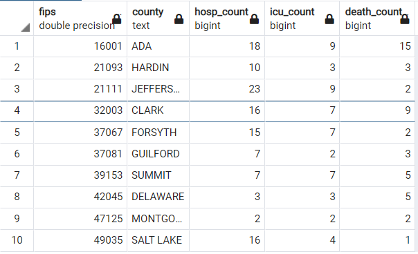
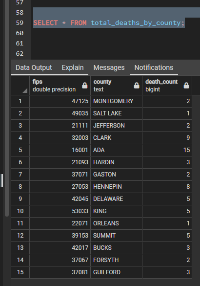

# COVID_Death_Analysis
An analysis of COVID-19 deaths and possible correlating factors

## Topic
Factors contributing to the death of COVID-19 patients 

## Topic Purpose
COVID-19 has affected nearly every person on this planet in at least one way since its outbreak in early 2020.  Many people have been impacted by the death of friends and/or family and are asking why this happened and if it could have been avoided. While those heavy questions may not be able to be answered fully by simple data analysis, we hope to generate conversation by using the COVID-19 Case Surveillance Public Use Data with Geography dataset to discover connections between certain demographic and geographic factors and death of COVID-19 patients.

##  Communication Protocols
A private Slack channel will be the primary means of communication along with online face-to-face meetings via Zoom in addition to alloted class time to check in and work through complex issues together. 

- Meeting 1: Tuesday, October 18, 9:00-9:45 pm 
- Meeting 2: Wednesday, October 19, 8:00-9:00 pm 
- Meeting 3: Thursday, October 20, 6:30-9:15 pm 
- Meeting 4: Tuesday, October 25, 7:00-9:00 pm
- Meeting 5: Thursday, October 27, 7:00-9:00 pm
- Meeting 6: Tuesday, November 1, 1:00-2:30 pm
- Meeting 7: Tuesday, November 1, 7:00-9:30 pm
- Meeting 8: Wednesday, November 2, 2:15-5:00 pm
- Meeting 9: Thursday, November 3, 6:30-9:30 pm

## Technologies
### Tools
- Github
- pgAdmin
- Jupyter Notebook
- Tableau
### Languages
- Python
- postgreSQL
### Libraries
- Pandas
- Numpy
- Pathlib
- sklearn
- sqlalchemy
- psycopg2
### Algorithms
- Logistic Regression
- SMOTEENN

## PRESENTATION LINK
https://docs.google.com/presentation/d/1mb-FrvVJSPmFRAVFaV_9wm2A9y0N-OhCBasbagVjU_E/edit?usp=sharing

## Questions to Answer
- What factors contributed most heavily to the deaths of people who contracted COVID-19?  
- Can this be used to build a machine learning model to predict the likelihood of death based on demographic and geographic factors?

## EXTRACT-TRANSFORM-LOAD

### Data Source -EXTRACT
https://data.cdc.gov/Case-Surveillance/COVID-19-Case-Surveillance-Public-Use-Data-with-Ge/n8mc-b4w4

This dataset is a deidentified patient-level record of reported COVID-19 cases from January 1, 2020 to present, updated once per month.  There are currently 87.3 million rows and 19 columns.  It was selected because of its large record quantity, presumption of quality, and our belief that it should have good predictive qualities and plenty to explore. We liked this dataset in particular because it includes geographic data.  The dataset includes the following factors:
- case month
- state of residence
- state FIPS code
- county of residence
- county FIPS code
- age group
- sex
- race
- ethnicity
- weeks between earliest date and date of first positive specimen collection
- weeks between earliest date and date of symptom onset
- process used to identify case
- exposure
- lab-confirmed vs. proable case
- symptomatic vs. asymptomatic
- hospitalization status
- ICU status
- death
- indication of underlying conditions (diabetes mellitus, hypertension, severe obesity (BMI>40), cardiovascular disease, chronic renal disease, chronic liver disease, chronic lung disease, other chronic diseases, immunosuppressive condition, autoimmune condition, current smoker, former smoker, substance abuse or misuse, disability, psychological/psychiatric, pregnancy, other)

An API call was placed to https://data.cdc.gov/resource/n8mc-b4w4.json to extract the data from the link above and exported to a csv file (cdc_api_df_all.csv). This code is found in the file named ETL_E_API_Export.ipynb.  

We chose to collect a large sample of records from the CDC and then drop any with NANs or values of "Unknown", "Missing", or "NA". Subsequent investigation with different samples of 1000 records showed anywhere from 1.5% - 3.3% of the records in a given dataset could remain post-cull. The code was adjusted to pull a total of 250,000 records from the API call as a precaution.

As a group we all thought this topic of missing data, removing records, etc. was a fascinating topic and one we wanted more time to investigate, but felt it was probably outside the project's scope. We are interested in if/how our data collection method could skew our data. Are we doing everything properly with this approach, or is this level of record removal too much? This is the first "real world" scenario we've encountered, but we didn't imagine so much missing information!

### Data Munging -TRANSFORM

The initial data cleanup effort (found in ETL_T&L.ipynb, which loads the raw API data, cleans it, and ultimately imports it into our database) occured while the API call of 250k records was still running.  Small sample datasets of 1000 records each from the CDC dataset were pulled into data frames and explored using functions and methods such as .head(), .describe(),.value_counts(), and .dtypes. This process guided several small pieces of draft cleanup code with the intention to repurpose them in the production code.

After the initial exploration, several other methods of data wrangling were used in preparation for data analysis: dropping a column/s, manipulating datetime into new columns, changing dtypes, and removing records based on a value.  The team collaborated to suggest better code to use, suggest different approaches, finalize the dataset, and narrow down which questions to explore. 

While doing final housekeeping, I noticed negative values populating the 'case_positive_specimen' feature for the first time. Given this feature's definition of 'Weeks between earliest date and date of first positive specimen collection' I decided these values warranted removal, and that all of the rest of my columns warranted a second .value_counts().

The second look proved fruitful; our cleaned dataset began revealing itself in ways it hadn't before. Or, more accurately, in ways I hadn't allowed it to yet. For example, records of patients residing in Utah, Ohio, Pennsylvania, and Kansas comprise 71.55% of the dataset, compared with only 20.04% of the raw API-called data. Futhermore, our final set contains records of patients residing in 19 unique states or territories, while the raw set, 45.

The implications of these observations and those of our constraints in obtaining the data are potentially enormous. Due to the slow speed of the API call, we were only able to call 250k records out of 87.3M, of which we only received 111,945 (a 0.13% sample of all of the data), which was then further reduced through the ETL process to 2,875 records... and now I don't know about anyone else in the room, but this kind of math hurts my brain a bit: these 2,875 records are a 2.57% sample of our first sample of 111,945 records -- which means they're only a 0.0033% sample of the original 87.3 million records from the CDC!

If we had more time, I would work my hardest to figure out why I can make a single API 'ping' to the CDC and get 1,000 records in what seems like instant, but specifying the number I'm wanting (even 1,000) takes exponentially longer.

I think the heart of the matter is most likely that our data collection process ran too short for me to collect enough records given the speed at which the API ran (2.5 days for 250k records) and therefore cleaning the data left us with some skewed observations.

Despite these observations, we kept moving forward so as to not fall behind on our deliverables. And logically, if turns out that we need to redo steps 2 or 3 in the pipeline, it will still make sense to have steps 1 and 4:25 complete so that everything plugs in.

After creating our database in pgAdmin (essentially just naming it 'COVID_MSU'), I added our code in Jupyter Notebook to create the connection between it and our clean dataset and its new database home.

#### Observations and Limitations of the Data
- Geographical distriibution is uneven.  The original API call only pulled one record each from several states.  After data cleanup, many of these states were eliminated due to missing values to the point we were only left with representation from about 20 states.  When broken into regions, this evened out more, however, the dataset as a whole is not representational of each state.

### Database -LOAD

This code is really cool. It takes our finished, cleaned dataset from our Jupyter Notebook file and pushes it right inside our new, empty database in pgAdmin.  It does this by first importing dependencies that allow us to create database engines, connections, and adaptors (fancy speak for all the tools we need to make this process possible). Next, we create "db_string", and since we are creating an engine, I like to think of 'db_string' as the key. It holds text containing a lot of information and instructions about our database, including its name, location, login credentials, and SQL flavor/dialect. So with all of this information complete within 'db_string', our code of 'engine = create_engine(db_string)' allows our program to point directly to the database called 'COVID_MSU' and interact with it using the 'engine' variable. The final line of code takes all of the data from our 'cdc_df1' DataFrame (or dataset, as I've been referring to it), and passes it to the to_sql() method. This line is a little friendlier, so one can almost read it left-to-right to see that our data frame is being converted to SQL as the table name 'cdc_df_import', using 'engine' as the connector/instantiatior, and replacing itself should it already be found.

The actual process moves much faster than I just described! In less than a second, we had our basic database!  This code and tables.sql was then sent to the other team members to create the database on their machines so they had easy access to the data as well.

It may also make the most sense now to note that very similar code is run to reverse this process to allow for an integration *from* the database *to* Jupyter Notebook for our logistic regression analysis. In his machine learning model, Brett will import the same dependencenies, and the same first two lines of 'connector code' creating 'db_string' and 'engine', making any changes particular to his pgAdmin/postgres credentials. However, the final line of code creates a DataFrame using a pandas method called 'read_sql_query()', which uses SQL to read from our specified database table via the 'engine' connection. I believe Brett is including this example within his ML code.

So from here, we created a series of tables in the database to both explore and help analyze trends in our data.  The following tables were created to filter the data and are not pictured though the code to create them is found in tables.sql:
- cases_by_region_midwest
- cases_by_region_northeast
- cases_by_region_south
- cases_by_region_west
- cases_by_sex_female
- cases_by_sex_male
- cdc_df_regions
- counties_and_codes
- states_and_codes
- zero_to_17
- eighteen_to_49
- fifty_to_64
- sixtyfive_plus
- lab_confirmed_cases
- probable_cases

## Data Exploration Phase
After spending time building the code to create our tables and looking through them, we began digging into them, but soon realized each category from the main data table (like age_range, for example) had been transformed into a series of tables aggregating unique category values (a table of records of 0-17 ages, one for 18-49 ages, etc.). In contrast, we only had a single table, 'region', where we instead took many state location values and categorized them into fewer. We instead thought, why not add 'region' on to our original table, save it as a new table by using conditionals to populate the US Census region for each case, and then use that data in Tableau to analyze our data?  This table is called cdc_df_regions.  We discovered this was needed when thinking about the visualizations and the desire to break data up into the regions of the United States to compare them all together instead of using separate region tables as created initially. 

Initial data exploration was conducted in pgAdmin in the creation of the county_counts table and the total_deaths_by_county table.  Three tables were created to count the number of hospitalizations, ICU admissions, and deaths.  Two inner joins were then performed to combine the information into one table, grouped by county.  The SQL code to duplicate this is found in the file tables.sql.  This exploration made it apparent that we lost much of the data that would have made the sample truly representative, as there were many fewer counties than the population represented.  

The total_deaths_by_county table represents the number of deaths for each county represented.  

 Once the database and its tables were created, we were able to export cdc_df_regions into a csv file and perform data exploration and visualization in Tableau.

## Analysis Phase
Most of the analysis was conducted using Tableau, a visual analytics platform built to take in multiple data sets and allows for nearly code-free visualizations of that data.  Age Range, Hospitalization Status, ICU Admission Status, Race, US Census Region, Sex, and Symptom Status were taken into consideration and compared with the total death count to visualize any correlation.  These tables are detailed below in the Dashboards section.

### Observations
- Distribution of cases by region/year
    - We saw that the West coast contained the most deaths by year during our dataset. Of course, with the caveat that our current geographical data isn't representative of the US as a whole, and therefore, most likely not of any statistical use.
- Distribution by Sex
    - Our dataset contains more females, above 50%, while men comprised over 50% of the deaths.
- Distribution by Race
    - The vast majority of fully-filled-out records (or, to put it another way, what remained from Andy's cleaning) belonged to Caucasian individuals. We unfortunately don't really have the data to draw any conclusions from this observation, only that we noticed it and it would be fascinating to conduct additional analysis into the finding.
- Symptomatic vs Asymptomatic
    - 5% of the deaths in our dataset were from asymptomatic cases.
- Distribution of cases by age range
    - Most cases in our dataset were records marked in the 18-49 age range, however, 64 out of our 66 deaths belonged to records marked in the 65+ age range.
- Hospitalization by age/race
    - We again found the 18 to 49 age group interesting for a number of reasons:
        - it contains largest count of records
        - it is largest range of years grouped (30, while some are less than half that amount)
        - it also has the most racial groups captured
    - We noticed the majority of deaths came from elder caucasians
- Icu Admissions by age/race
    - while 15 from 18-49 were admitted to the ICU, none passed
- All Geographic Visualizations
    - We developed a great series of geographic visualization tools here to do a more robust analysis if we can work in the time to obtain a more distributed geographical dataset.

## Machine Learning Model
Logistic Regression was chosen because there was a specific target that was being predicted, and the actual outcomes were known. Therefore, Supervised machine learning is the best option. Since death has a binary outcome, either the person died or they did not, Logistic regression made sense with its ability to predict binary outcomes. 

### Preliminary Data Preprocessing
After loading in the data from the SQL database, the new dataframe was printed to inspect the columns and data types. Pandas get dummies method was used to change all categorical columns so that it would be able to be analyzed by the machine learning model. Label encoder was used from the SKLearn Library one other columns that used string types such as True and False to switch it to numerical data types. Columns that were not useful for the machine learning model were dropped from the dataframe. 

### Preliminary Feature Engineering and Selection
Since the main question for the project was to use data from the CDC to predict death based off factors such as hospitalization, sex, ethnicity, and symptom status, the target selection was clearly the Death column. The remaining features were used as features for the machine learning model, except for the duplicate index columns and the state code, which was already represented from the state column.  Leaving county and state as features will allow for future analysis on whether geographic location had an impact on Covid deaths. 

### Training and Testing
Data was split into training and testing with the Train_test_split function from the SKLearn library with the default options. Stratify=y was used to ensure that when the data was split into training and testing sets that a proportional amount of the target variable would be distributed among each.  After noticing the balance of the target outcomes, the data was also resampled using the SMOTEEN sampling algorithm from the IMBLearn library. 

### Limitations and Benefits
The limitations include the possibility of overfitting the data, and new data would not be as predictable. Another limitation is that the logistic regression model is not as complex or robust as neural networks or deep learning models. 

### Accuracy Score
COMING SOON!

## Dashboards
The dashboards will be created using Tableau.  It will include the following dashboards organized into perspectives.  This will allow for more visualizations without crowding them onto one viewing space.

The link to the Tableau Worksheets and Dashboards is https://public.tableau.com/app/profile/mandy.glynn/viz/COVIDAnalysis_16675052127620/Reg_Hosp?publish=yes

### Distribution Dashboard
- Distribution of Cases by Region and Year
    - Packed Bubbles
    - Shows a comparison of bubble size of total cases for each region and each year
    - Filterable by Death Y/N to see the same comparison of those who died
- Distribution by Sex
    - Pie Graph
    - Shows total cases broken up by Male and Female (the "other" category was eliminated for null or missing values during data cleanup)
    - Filterable by Death Y/N to see the same comparison of those who died
- Distribution by Race
    - Horizontal Bar Graph
    - Shows total cases broken up by race
    - Filterable by Death Y/N to see the same comparison of those who died
- Distribution of Cases by Symptomatic vs. Asymptomatic
    - Chart
    - Shows total cases broken up by Asymptomatic and Symptomatic status
    - Filterable by Death Y/N to see the same comparison of those who died
- Distribution by Age Range
    - Treemap
    - Shows comparison of number of cases broken into age ranges
    - Filterable by Death Y/N to see the same comparison of those who died
### Age and Race Dashboard
- Hospitalized by Age and Race
    - Bar Graph
    - Shows a breakdown of total cases where the patient was hospitalized by age range and race
    - Filterable by Death Y/N to see how many in each category died while hospitalized
- ICU Admissions by Age and Race
    - Bar Graph
    - Shows a breakdown of total cases where the patient was admitted to the ICU by age range and race
    - Filterable by Death Y/N to see how many in each category died while in the ICU
- Deaths by Age and Race
    - Bar Graph
    - Shows a breakdown of total deaths by age range and race
    - Filter is set to Death Yn: True
### UNDER CONSTRUCTION...Date dashboard...UNDER CONSTRUCTION
- Factors by month
    - Bar Graph -stacking
    - Filterable by year and factor
- Counts over time
    - Line Graph
    - Filterable by factor to show one or more factors at a time
### Geographical dashboard
- Hospitalization, ICU, and Death by Census Region
    - 3 Bar Graphs
    - Each graph is filterable by death status to compare how many hospitalization and icu cases in each region resulted in death 
- Death Count by Location
    - Geographical map showing which states had the highest deaths by circle size

## Recommendations for Future Analysis
Considering we were only able to retain a very small percentage of the original data once null/missing/NA values were removed, an interesting exploration would be WHY those values are missing.  Did providers from a certain region/state/county routinely underreport their patient information?  Did patients from one ethnicity or race have more or less information included about their case?  What does that say about the healthcare system or providers in the United States?

## Project Reflections
### Teamwork
"We're all working really well together both in coming up with ideas and in grounding back to focus on the tasks at hand and next steps to take."

### We wish we could have...
In hindsight we would have liked a more representative sampling of the data as the large number of null and values marked as "missing" culled the majority of the rows.  This was difficult given the limitations of personal computers with limited processing power.  It took two full days of running the API call to pull 250,000 records, of which 2,800 were filled out enough to keep for analysis.  Had this been completed with more powerful machines, such as might be found in the corporate setting, we feel we would be able to pull a larger dataset in a shorter time and been able to retain more records.
