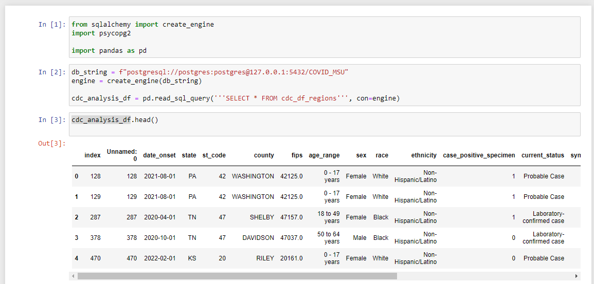

# Description

Readme contributions for arutledge Segment 1 & 2 Database work

## Summary

## Narrative

We chose a COVID-19 dataset from the CDC. We selected because of its of large record quantity and our presumption of quality, and our belief that it 
should have good predictive qualities and plenty to explore. We liked this dataset in particular because it includes geographic data, and while we're not sure if that data will be included
within our scope at this point, it's very good to have it should we need it. 
https://data.cdc.gov/Case-Surveillance/COVID-19-Case-Surveillance-Public-Use-Data-with-Ge/n8mc-b4w4

In looking at the API documentation, I initially thought I needed to sign up for a SODA account (Socrata Open Data API) as well as obtain their app token. While going down that rabbit hole was fun, 
it turns out all I've needed (so far) to make the API call from the CDC site is the json endpoint itself (https://data.cdc.gov/resource/n8mc-b4w4.json) with no authenticating API key etc. 

In examining the data (ETL.ipynb contains my beginning data exploration code, as well as drafts for my 'production' files) I noticed that nearly all records in the data contained some form
of missing information. When Mandy, Brett, and I met outside of class hours to discuss the project, we took up this topic under the database as a whole. We chose to collect 
a large sample of records from the CDC and then drop any with NANs or values of "Unknown", "Missing", or "NA". Subsequent investigation with different samples of 1000 
records showed anywhere from 1.5% - 3.3% of the records in a given dataset could remain post-cull. I adjusted code to pull a total of 250,000 records from the API call as a precaution and buckled in 
for a fun night with my trusty computer :)

As a group we all thought this topic of missing data, removing records, etc. was a fascinating topic and one we wanted more time to investigate, but felt it was probably outside the project's scope. I know we are
interested, however, in if/how our data collection method could skew our data - are we doing everything properly with this approach, or is this level of record removal too much? This is the first "real world" scenario 
I've encountered, but I didn't imagine so much missing information!

        ~We subsequently had a discussion with Dimas, Farukh, and Alex regarding this topic and all of our null data

While my API call of 250k records was still running, I examined small sample datasets of 1000 records each from the CDC dataset using functions and methods such as .head(), .describe(), .value_counts(), and .dtypes. This process guided me to 
write several small pieces of draft cleanup code on the small datasets that will then be repurposed in the production code to clean up the large dataset from the finished API call. 
                    Explored dropping a column/s, manipulating datetime into new columns, changing dtypes, removing records based on a value, describe
Feedback from Mandy and Brett was essential during this time to help suggest better code to use, suggest approaches, discuss which dataset(s?) to use and which question to answer. I feel we're all working really well together
both in coming up with ideas and in grounding back to focus on the tasks at hand and next steps to take. 

-saved as CSV as soon as api complete

### Descriptions for Segment 2
#### Data Exploration, Data Analysis, Database 

Our goal this week with regards to data management was to take the results of our API call in Jupyter Notebook and wrap up the cleaning/exploration process there. We would then create a database using pgAdmin in which to store our resulting dataset. Next, we'd import the dataset into the new database, and then within the database, create data tables that would hopefully both analyze the data and suggest further analyses and visualizations. Finally, we planned to integrate the database with our logistic regression model.

While doing final housekeeping with our dataset in my 'ETL_T&L.ipynb' file (which loads the raw API data, cleans it, and ultimately imports it into our database), I noticed negative values populating the 'case_positive_specimen' feature for the first time. Given this feature's definition of 'Weeks between earliest date and date of first positive specimen collection' I decided these values warranted removal, and that all of the rest of my columns warranted a second .value_counts(). 

The second look proved fruitful; our cleaned dataset began revealing itself in ways it hadn't before. Or, more accurately, in ways I hadn't allowed it to yet. For example, records of patients residing in Utah, Ohio, Pennsylvania, and Kansas comprise 71.55% of the dataset, compared with only 20.04% of the raw API-called data. Futhermore, our final set contains records of patients residing in 19 unique states or territories, while the raw set, 45.

The implications of these observations and those of our constraints in obtaining the data are potentially enormous. Due to the slow speed of the API call, we were only able to call 250k records out of 87.3M, of which we only received 111,945 (a 0.13% sample of all of the data), which was then further reduced through the ETL process to 2,875 records... and now I don't know about anyone else in the room, but this kind of math hurts my brain a bit: these 2,875 records are a 2.57% sample of our first sample of 111,945 records -- which means they're only a 0.0033% sample of the original 87.3 million records from the CDC! 

If we had more time, I would work my hardest to figure out why I can make a single API 'ping' to the CDC and get 1,000 records in what seems like instant, but specifying the number I'm wanting (even 1,000) takes exponentially longer. 

I think the heart of the matter is most likely that our data collection process ran too short for me to collect enough records given the speed at which the API ran (2.5 days for 250k records) and therefore cleaning the data left us with some skewed observations. 

Despite these observations, we kept moving forward so as to not fall behind on our deliverables. And logically, if turns out that we need to redo steps 2 or 3 in the pipeline, it will still make sense to have steps 1 and 4:25 complete so that everything plugs in. 

After creating our database in pgAdmin (essentially just naming it 'COVID_MSU'), I added our code in Jupyter Notebook to create the connection between it + our clean dataset and its new database home.  

This code is really cool. It takes our finished, cleaned dataset from our Jupyter Notebook file and pushes it right inside our new, empty database in pgAdmin.  It does this by first importing dependencies that allow us to create database engines, connections, and adaptors (fancy speak for all the tools we need to make this process possible). Next, we create "db_string", and since we are creating an engine, I like to think of 'db_string' as the key. It holds text containing a lot of information and instructions about our database, including its name, location, login credentials, and SQL flavor/dialect. So with all of this information complete within 'db_string', our code of 'engine = create_engine(db_string)' allows our program to point directly to the database called 'COVID_MSU' and interact with it using the 'engine' variable. The final line of code takes all of the data from our 'cdc_df1' DataFrame (or dataset, as I've been referring to it), and passes it to the to_sql() method. This line is a little friendlier, so one can almost read it left-to-right to see that our data frame is being converted to SQL as the table name 'cdc_df_import', using 'engine' as the connector/instantiatior, and replacing itself should it already be found. 

The actual process moves much faster than I just described! In less than a second, we had our basic database!

Please note that I sent this code snippet, as well as a csv created from the 'cdc_df1' dataframe, to Brett and Mandy so they could create their own instances of the database on their local machines. I also sent them the 'tables.sql' file (mentioned below). 

It may also make the most sense now to note that very similar code is run to reverse this process to allow for an integration *from* the database *to* Jupyter Notebook for our logistic regression analysis. In his machine learning model, Brett will import the same dependencenies, and the same first two lines of 'connector code' creating 'db_string' and 'engine', making any changes particular to his pgAdmin/postgres credentials. However, the final line of code creates a DataFrame using a pandas method called 'read_sql_query()', which uses SQL to read from our specified database table via the 'engine' connection. I believe Brett is including this example within his ML code. 

So from here, we created a series of tables in the database to both explore and help analyze trends in our data. All SQL code for the tables may be viewed in the file 'tables.sql' and I'm so in debt to Mandy for her creativity in thinking of these many possibilities. I am growing more comfortable with code but struggle in thinking of ways to 'slice and dice' the data in the sense of aggregating, averaging, summing, grouping, etc. -- I find that piece takes more of my concentration and time. 

Our tables stand grouped by Age_Range category (4 tables), case type (2 tables), m/f gender as these were the only values provided (2 tables), US Census Region which Mandy sleuthed together (4 tables), 2 general county counts for potential future use, 3 tables sorted by county for our "yes" and "no" values (hospitalized, icu patient, and death), and one 'put everything together by county' table using INNER JOINs that we are still in the process of tweaking. 

After spending time building the code to create our tables and looking through them, we began digging into them, but soon realized each category from the main data table (like age_range, for example) had been transformed into a series of tables aggregating unique category values (a table of records of 0-17 ages, one for 18-49 ages, etc.). In contrast, we only had a single table, 'region', where we instead took many state location values and categorized them into fewer. We instead thought, why not add 'region' on to our original table, save it as a new table, and then use that data in Tableau to analyze our data?

We created the following visualizations in Tableau:

- dist cases by region/year
        - We saw that the West coast contained the most deaths by year during our dataset. Of course, with the caveat that our geographical data isn't representative of the US as a whole, and therefore, most likely not of any statistical use.  

- dist by sex
        - Our dataset contains more females, above 50%, while men comprised over 50% of the deaths.

- race
        - The vast majority of fully filled out records (or, to put it another way, what remained from Andy's cleaning) belonged to Caucasian individuals. We unfortunately don't really have the data to draw any conclusions from this observation, only that we noticed it and it would be fascinating to conduct additional analysis into the finding. 
        

-sympt v asympt
        - 5% of the deaths in our dataset were from asymptomatic cases.

-dist of cases by age range
        - Most cases in our dataset were records marked in the 18-49 age range, however, 64 out of our 66 deaths belonged to records marked in the 65+ age range. 

- hosp by age/race
        - We again found the 19 to 49 age group interesting for a number of reasons:
                - it contains largest count of records 
                - it is largest range of years grouped (30, while some are less than half that amount)
                - it also has the most racial groups captured
        - We noticed the majority of deaths came from elder caucasians

- icu admit by age/race
        - while 15 from 18-49 were admitted to the ICU, none passed

- death count by location
        - We developed a great series of geographic visualization tools here to do a more robust analysis if we can work in the time to obtain a more distributed geographical dataset. 

- hosp by region
        - same ^^

- icu adm by region
        - ^^

- deaths by region
        - ^^

